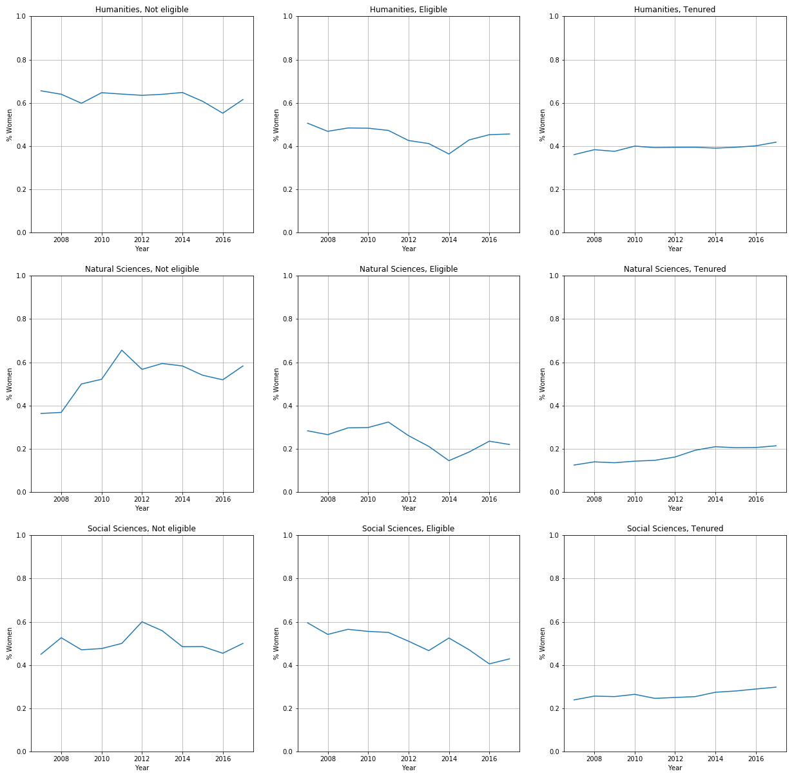
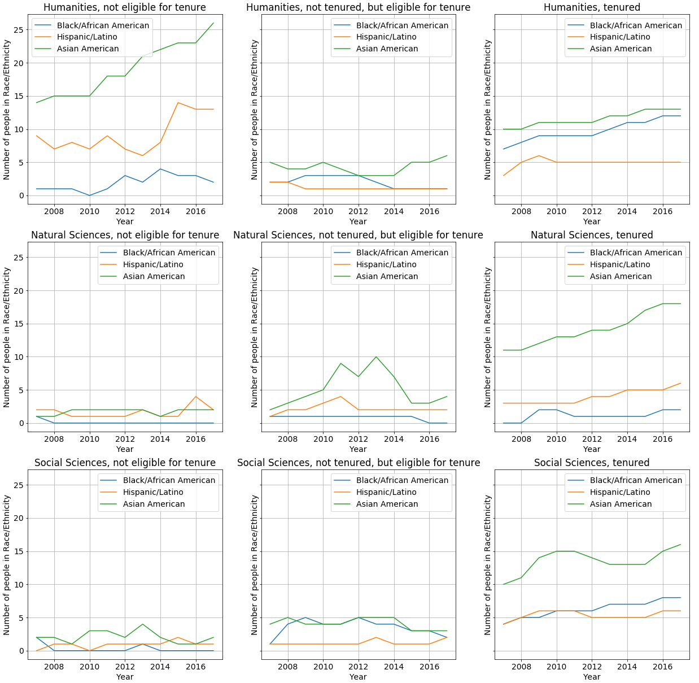

_Idea: an actual leaking pipeline. Have color-coded dots that "leak" out of the main pipeline as we advance faculty status. (But remember, the MVP is still just the you-draw-it's.)_

_Idea: Collect statistics on guessed answers._

# Faculty Diversity at Columbia University

## Story

### General thoughts
- ENG-NE: how can we best visualize zero values?

## Data

Data was taken from the Office of the Provost ([source](https://provost.columbia.edu/content/faculty-diversity)). Raw data was unavailable to download, so I took screenshots of data tables, converted them to Excel files with an [online OCR](https://www.onlineocr.net/), and combined those with Python and pandas.

